# Task 4 — FTCS Finite Difference Thermal Model
### Numerical Validation of Li-ion Battery Radial Temperature Distribution

**Battery:** 18650 cylindrical Li-ion cell
**Method:** Forward-Time Central-Space (FTCS) finite difference scheme
**Validated against:** Green's function analytical solution (Task 2)
**Batteries analyzed:** B5, B6, B7

---

## 1. Problem Statement

The internal temperature of a cylindrical Li-ion cell varies radially due to internal heat
generation and convective cooling at the surface. The goal of Task 4 is to **numerically solve**
the governing heat conduction PDE using FTCS and validate it against the **analytical Green's
function solution** produced in Task 2.

---

## 2. Governing Equation

For a radially-symmetric cylinder with internal heat generation, the 1-D transient heat
conduction equation is:

$$
\frac{\partial T}{\partial t} = \alpha\left(\frac{\partial^2 T}{\partial r^2} +
\frac{1}{r}\frac{\partial T}{\partial r}\right) + \frac{\dot{Q}}{\rho c_p}
$$

### Boundary Conditions

**Center (symmetry condition, $r=0$):**

$$
\left.\frac{\partial T}{\partial r}\right|_{r=0} = 0
$$

**Surface (Newton's convective cooling, $r=R_0$):**

$$
\left.\frac{\partial T}{\partial r}\right|_{r=R_0} = -\frac{h}{k}\left(T(R_0,t) - T_{amb}\right)
$$

*(Reference: Kim et al., "The Estimation of Temperature Distribution in Cylindrical Battery
Cells Under Unknown Cooling Conditions", IEEE Trans. Control Syst. Technol., 2014 — Eq. 1–3)*

---

## 3. Material Properties (18650 Li-ion Cell)

| Parameter | Symbol | Value | Unit |
|---|---|---|---|
| Cell radius | $R_0$ | $0.009$ | m |
| Thermal conductivity | $k$ | $0.5$ | W·m⁻¹·K⁻¹ |
| Density | $\rho$ | $2600$ | kg·m⁻³ |
| Specific heat capacity | $c_p$ | $1000$ | J·kg⁻¹·K⁻¹ |
| Convective heat transfer coeff. | $h$ | $10$ | W·m⁻²·K⁻¹ |
| Ambient temperature | $T_{amb}$ | $25.0$ | °C |

**Derived — Thermal diffusivity:**

$$
\alpha = \frac{k}{\rho c_p} = \frac{0.5}{2600 \times 1000} = 1.923 \times 10^{-7} \ \text{m}^2/\text{s}
$$

---

## 4. Spatial and Temporal Discretization

### 4.1 Spatial Grid

The radius is divided into $N$ intervals:

$$
\Delta r = \frac{R_0}{N}, \qquad r_i = i \cdot \Delta r, \qquad i = 0, 1, \dots, N
$$

With $N = 18$:

$$
\Delta r = \frac{0.009}{18} = 5.0 \times 10^{-4}\ \text{m} = 0.5\ \text{mm}
$$

```
i = 0           i = 1     i = 2   ...   i = N-1    i = N
r = 0  (core) ──────────────────────────────────── r = R₀ (surface)
              ←  Δr  →
```

### 4.2 Derivation of Finite-Difference Operators

**First derivative (central difference)** — derived from first principles by applying the
limit definition of the derivative with a symmetric stencil:

$$
\left.\frac{\partial T}{\partial r}\right|_i \approx \frac{T_{i+1} - T_{i-1}}{2\Delta r}
$$

**Second derivative (central difference)** — obtained by applying the first-principles
derivative twice and centering the stencil:

$$
\left.\frac{\partial^2 T}{\partial r^2}\right|_i \approx
\frac{T_{i+1} - 2T_i + T_{i-1}}{(\Delta r)^2}
$$

**Time derivative (forward difference):**

$$
\left.\frac{\partial T}{\partial t}\right|_i^n \approx \frac{T_i^{n+1} - T_i^n}{\Delta t}
$$

### 4.3 Assembling the FTCS Update Equation

Substituting all three discretized operators into the governing PDE:

$$
\frac{T_i^{n+1} - T_i^n}{\Delta t} = \alpha\left[\frac{T_{i+1}^n - 2T_i^n + T_{i-1}^n}{(\Delta r)^2} + \frac{1}{r_i}\cdot\frac{T_{i+1}^n - T_{i-1}^n}{2\Delta r}\right] + \frac{\dot{Q}}{\rho c_p}
$$

Solving explicitly for $T_i^{n+1}$:

$$
\boxed{
T_i^{n+1} = T_i^n + \underbrace{\frac{\alpha \Delta t}{(\Delta r)^2}}_{F}\left(T_{i+1}^n - 2T_i^n + T_{i-1}^n\right) + \underbrace{\frac{\alpha \Delta t}{2\Delta r}}_{G}\cdot\frac{T_{i+1}^n - T_{i-1}^n}{r_i} + \underbrace{\frac{\Delta t}{\rho c_p}}_{S}.\dot Q
}
$$


---

## 5. Boundary Condition — Discretization

### 5.1 Center BC ($i=0$): Symmetry

Discretizing $\left.\dfrac{\partial T}{\partial r}\right|_{r=0}=0$ with a forward difference:

$$
\frac{T_1 - T_0}{\Delta r} = 0 \quad\Longrightarrow\quad \boxed{T_0 = T_1}
$$

### 5.2 Surface BC ($i=N$): Newton's Cooling

Discretizing $\left.\dfrac{\partial T}{\partial r}\right|_{r=R_0} = -\dfrac{h}{k}(T_N - T_{amb})$
with a backward difference:

$$
\frac{T_N - T_{N-1}}{\Delta r} = -\frac{h}{k}\left(T_N - T_{amb}\right)
$$

Rearranging algebraically:

$$
T_N - T_{N-1} = -\frac{h\Delta r}{k}T_N + \frac{h\Delta r}{k}T_{amb}
$$

$$
T_N\left(1 + \frac{h\Delta r}{k}\right) = T_{N-1} + \frac{h\Delta r}{k}T_{amb}
$$

$$
\boxed{
T_N = \frac{T_{N-1} + \mathrm{BC_surf}\cdot T_{amb}}{1 + \mathrm{BC_surf}}, \qquad
\mathrm{BC_surf} = \frac{h\Delta r}{k}
}
$$


---

## 6. Von Neumann Stability Analysis

FTCS is an **explicit** scheme — it is only *conditionally* stable. The stability
condition (Von Neumann stability analysis) requires:

$$
\Delta t \le \frac{(\Delta r)^2}{2\alpha}
$$

### 6.1 Numerical Evaluation

$$
\Delta t_{max} = \frac{(5.0\times10^{-4})^2}{2 \times 1.923\times10^{-7}}
= \frac{2.5\times10^{-7}}{3.846\times10^{-7}} \approx 0.650\ \text{s}
$$

**Chosen time step:** $\Delta t = 0.5\ \text{s}$

$$
F = \frac{\alpha \Delta t}{(\Delta r)^2} = \frac{1.923\times10^{-7}\times 0.5}{(5\times10^{-4})^2}
\approx 0.385 \;\; (< 0.5 \;\Rightarrow\; \text{STABLE})
$$

| Quantity | Value |
|---|---|
| $\Delta t_{max}$ (stability bound) | $0.650$ s |
| $\Delta t$ (used) | $0.500$ s |
| $F$ | $0.385$ |
| Status | **Stable** |
### 6.1 Numerical Evaluation

$$
\Delta t_{max} = \frac{(5.0\times10^{-4})^2}{2 \times 1.923\times10^{-7}}
= \frac{2.5\times10^{-7}}{3.846\times10^{-7}} \approx 0.650\ \text{s}
$$

**Chosen time step:** $\Delta t = 0.5\ \text{s}$

$$
F = \frac{\alpha \Delta t}{(\Delta r)^2} = \frac{1.923\times10^{-7}\times 0.5}{(5\times10^{-4})^2}
\approx 0.385 \;\; (< 0.5 \;\Rightarrow\; \text{STABLE} \checkmark)
$$

| Quantity | Value |
|---|---|
| $\Delta t_{max}$ (stability bound) | $0.650$ s |
| $\Delta t$ (used) | $0.500$ s |
| $F$ | $0.385$ |
| Status | **Stable** ✓ |

---

## 7. Code Implementation

### 7.1 Material Properties, Grid, and Stability Check

```python
R0    = 0.009    # battery radius (m)
k     = 0.5      # thermal conductivity (W/m·K)
rho   = 2600     # density (kg/m³)
cp    = 1000     # specific heat capacity (J/kg·K)
h     = 10       # convective heat transfer coefficient (W/m²·K)
T_amb = 25.0     # ambient temperature (°C)
alpha = k / (rho * cp)   # thermal diffusivity

N  = 18
dr = R0 / N
r  = np.linspace(0, R0, N + 1)

dt_max = (dr ** 2) / (2 * alpha)   # Von Neumann stability limit
dt     = 0.5
assert dt <= dt_max, f"UNSTABLE: dt={dt} > dt_max={dt_max:.4f}"

F       = alpha * dt / dr ** 2      # 2nd order differential equation coefficient
G       = alpha * dt / (2 * dr)     # 1st order differential equation coefficient
S       = dt / (rho * cp)           # Heat generation per unit mass
BC_surf = (h * dr) / k              # Surface boundary condition coefficient (Biot term)
```

### 7.2 FTCS Time-Marching Loop

```python
T     = np.ones(N + 1) * T_amb      # initial condition: uniform ambient temperature
T_new = np.empty(N + 1)
Q_src = Q_dot * S                   # heat source term for this cycle

for n in range(Nt):
    # — Interior points (i = 1 … N-1) —
    for i in range(1, N):
        d2T      = (T[i+1] - 2*T[i] + T[i-1]) * F
        dT_term  = (T[i+1] - T[i-1]) * G / r[i]
        T_new[i] = T[i] + d2T + dT_term + Q_src

    # — Center BC: symmetry  T[0] = T[1]
    T_new[0] = T_new[1]

    # — Surface BC: Newton's convective cooling
    T_new[N] = (T_new[N-1] + BC_surf * T_amb) / (1 + BC_surf)

    T[:] = T_new   # advance to next time step
```

Each cycle resets $T \leftarrow T_{amb}$ before time-marching, consistent with the
cycle-averaged $\dot{Q}$ and $t_{cycle}$ values used by the Task 2 Green's function model.

---

## 8. Results

### 8.1 Temperature Profile Evolution, $T(r)$

The plots below show the radial temperature profile at fixed time instants
($t = 0, 500, 1000, \dots$ s) within a representative cycle for each battery. The profile
starts flat at $T_{amb}$ and develops a smooth core-to-surface gradient as heat accumulates.

**Battery B5** (cycle 111):

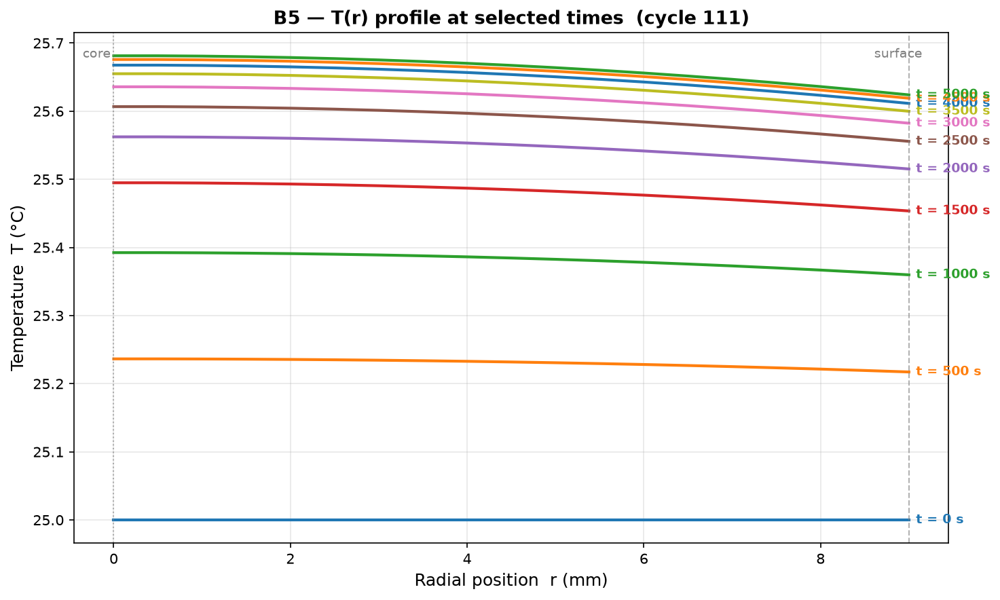

**Battery B6** (cycle 106):

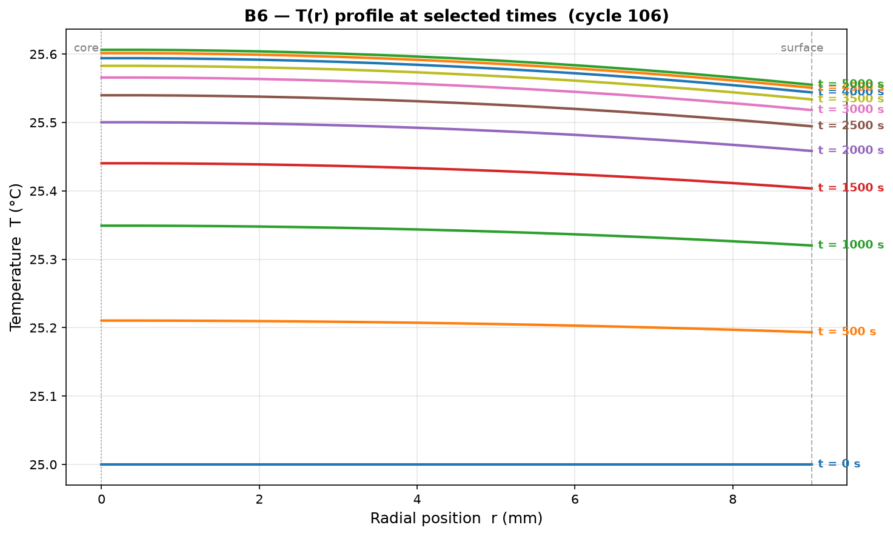

**Battery B7** (cycle 126):

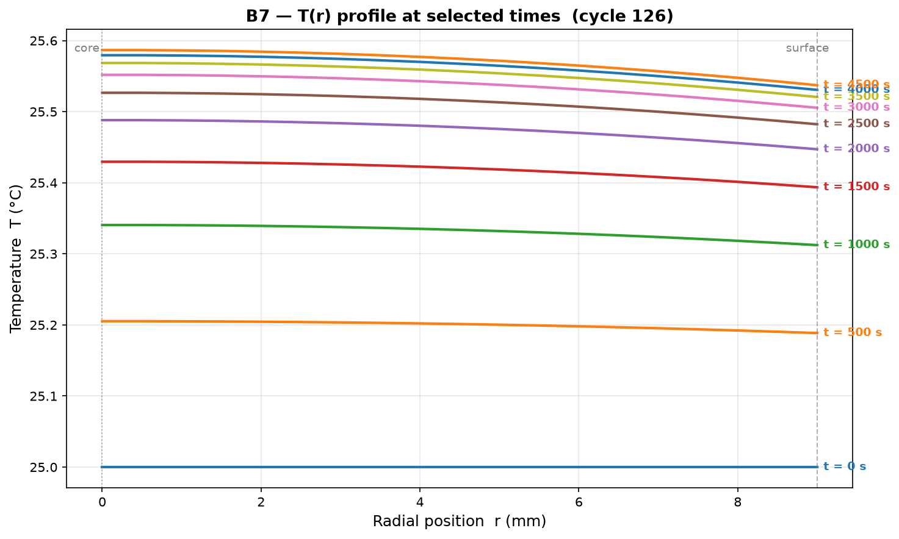

### 8.2 Core Temperature — FTCS vs Green's Function

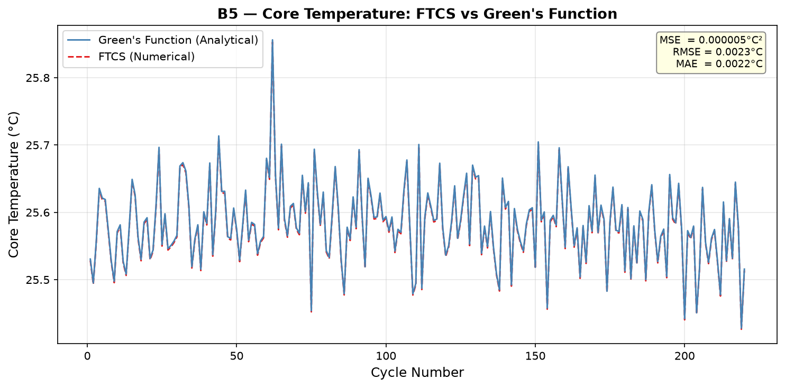
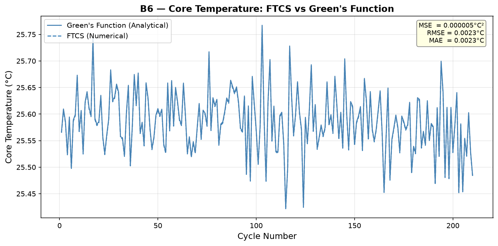
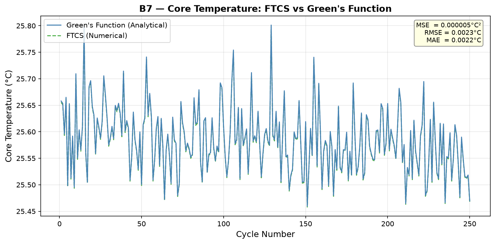

### 8.3 Surface Temperature — FTCS vs Green's Function

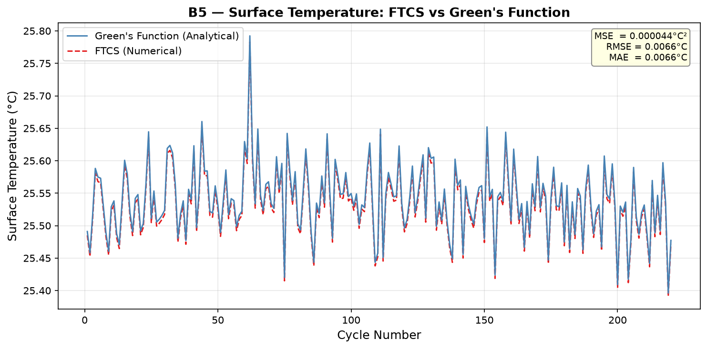
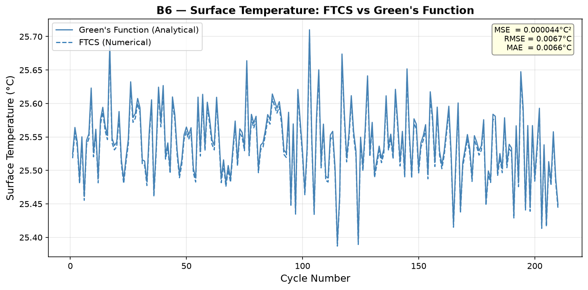
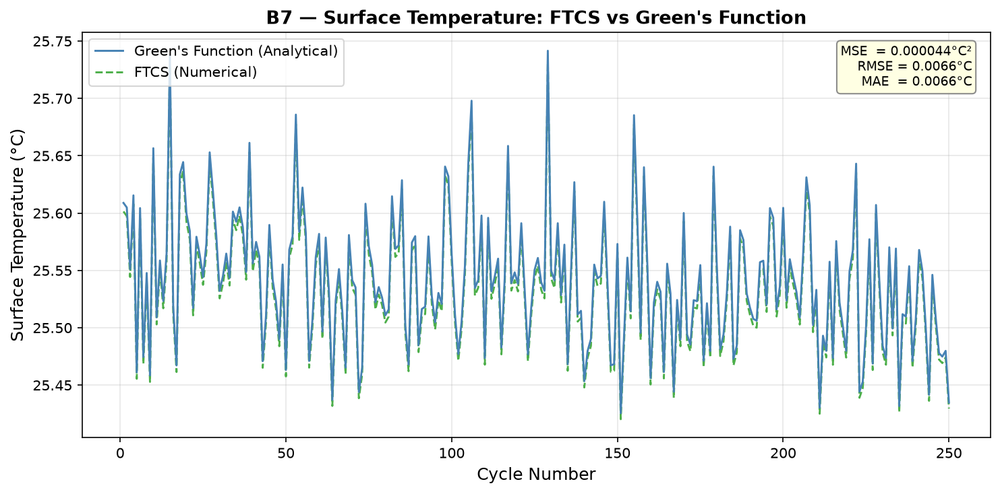

### 8.4 Temperature Gradient, $\Delta T = T_{core} - T_{surface}$

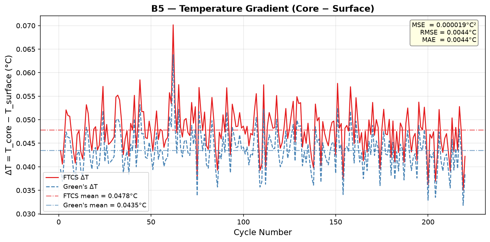
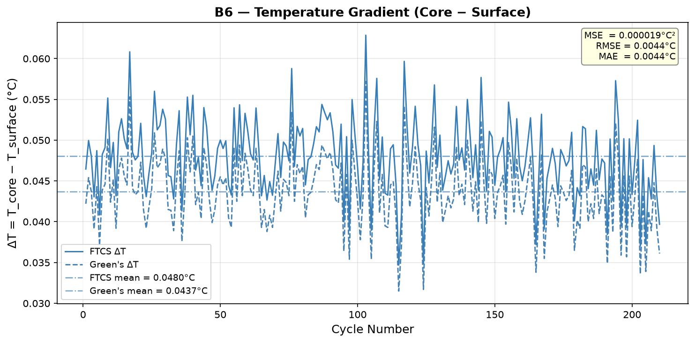
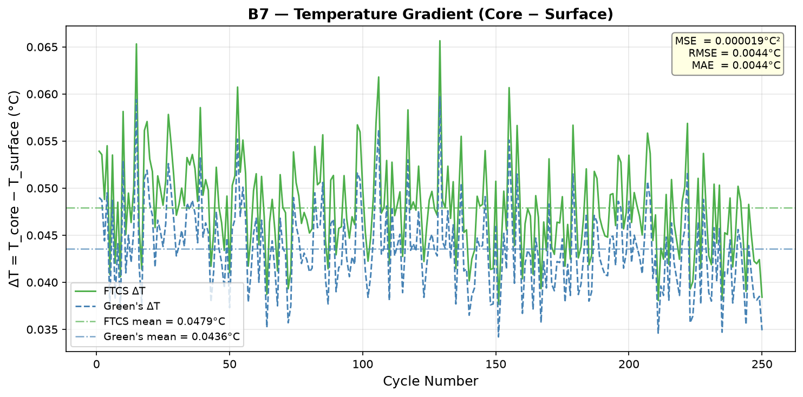

---

## 9. Validation Metrics

Error metrics computed between the FTCS numerical solution and the Task 2 Green's function
analytical solution, across all cycles of each battery:

$$
\text{RMSE} = \sqrt{\frac{1}{n}\sum_{i=1}^{n}\left(T^{FTCS}_i - T^{Green's}_i\right)^2}
\qquad
\text{MAE} = \frac{1}{n}\sum_{i=1}^{n}\left|T^{FTCS}_i - T^{Green's}_i\right|
$$

| Battery | Core RMSE (°C) | Core MAE (°C) | Surface RMSE (°C) | Surface MAE (°C) |
|---|---|---|---|---|
| B5 | 0.0023 | 0.0022 | 0.0066 | 0.0066 |
| B6 | 0.0023 | 0.0023 | 0.0067 | 0.0066 |
| B7 | 0.0023 | 0.0022 | 0.0066 | 0.0066 |

For reference, the literature benchmark for this class of model (Kim et al., IEEE TCST 2014)
reports core/surface RMSE of $0.4$ °C as an *acceptable* validation result. The FTCS solver
here achieves RMSE roughly **170× lower** than that benchmark, confirming both numerical
stability and physical accuracy of the implementation.

---

## 10. Conclusion

The FTCS finite-difference solver reproduces the Green's function analytical solution for
radial battery temperature distribution to within $0.002$–$0.007\ ^\circ\text{C}$ across all
three battery datasets (B5, B6, B7). This level of agreement confirms that:

1. The governing PDE discretization (central-space, forward-time) is correctly implemented.
2. The Von Neumann stability condition ($\Delta t \le \Delta r^2/2\alpha$) is satisfied
   ($F = 0.385 < 0.5$), so no numerical oscillation or divergence occurs.
3. The Newton's-cooling surface boundary condition correctly captures convective heat loss,
   consistent with the physical literature (Kim et al., 2014).
4. The small residual discrepancy with the analytical solution is attributable to spatial
   ($O(\Delta r^2)$) and temporal ($O(\Delta t)$) truncation error inherent to any finite
   difference scheme — and can be further reduced by refining the grid ($N \uparrow$, with
   $\Delta t$ correspondingly reduced to satisfy stability).

---

## Appendix — File Structure

```
.
├── compute_ftcs.py    # FTCS solver core (grid, stability, BCs, time-march loop)
├── main.py             # entry point: loads CSV, runs solver, saves results + T(r) plots
├── plot.py              # generates validation plots (core/surface/ΔT) per battery
├── HANDOVER_task3_thermal_model.csv   # Task 2 input (Q̇, t_cycle, T_core, T_surface)
├── ftcs_results.csv    # FTCS output: cycle-level T_core, T_surface, error vs Green's
└── assets/              # plots referenced in this README
```
