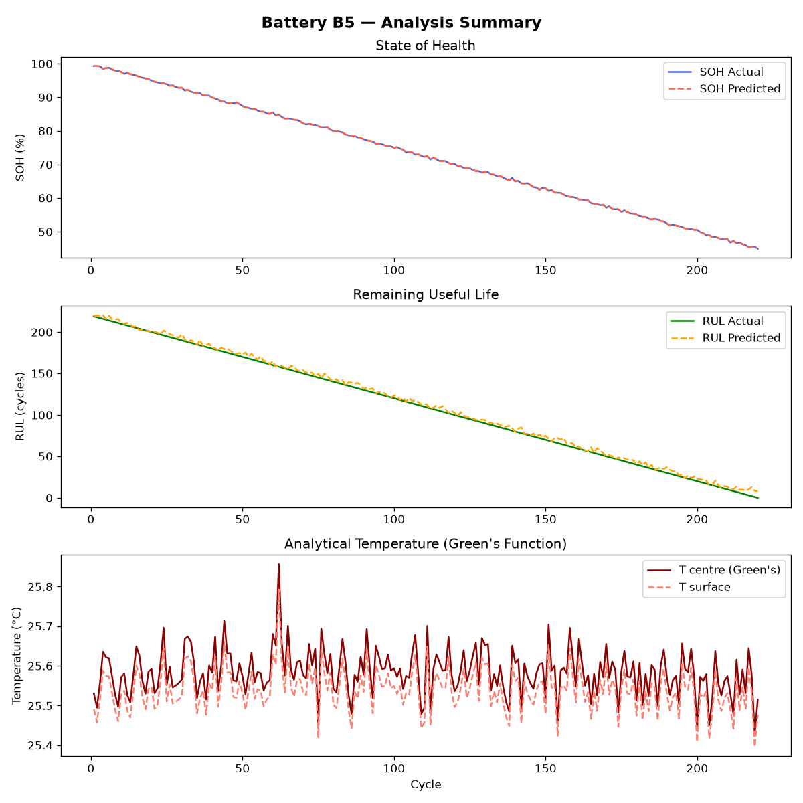

# Battery Health Analysis Pipeline - Tasks 1 & 2

## Overview

The pipeline is structured into several tasks, focusing on predicting Remaining Useful Life (RUL), State of Health (SOH), and estimating core/surface temperatures analytically.

---

### Task 1: ML Models for SOH & RUL Prediction

Machine learning models are trained to map operational charging/discharging characteristics to health metrics.

**Features Used (`X`):**
- `cycle`: Current cycle number
- `chI`, `chV`, `chT`: Average Current, Voltage, and Temperature during the charge phase
- `disI`, `disV`, `disT`: Average Current, Voltage, and Temperature during the discharge phase
- `BCt`: Battery Cycle Time

**Targets (`y`):**
- **SOH** (State of Health)
- **RUL** (Remaining Useful Life)

**Methodology:**
1. **Preprocessing**: The feature matrix is standardized using `StandardScaler` (zero mean, unit variance).
2. **Modeling**: The models evaluated include Random Forest, Gradient Boosting, K-Nearest Neighbors (k=5), and Support Vector Machine (RBF kernel).
3. **Validation**: 5-fold cross-validation is used to calculate Mean Absolute Error (MAE), Root Mean Squared Error (RMSE), and R-squared ($R^2$).
4. **Selection**: **Random Forest** is selected as the best performing model and is utilized to generate final predictions across all data points.

**Outputs:**
- `task1_ml_model_results.csv`: Cross-validation performance metrics (MAE, RMSE, R²) for all tested models.

---

### Task 2: Green's Function Temperature Analytical Model

An analytical thermal model is implemented to estimate the core ($r=0$) and surface ($r \approx R_0$) temperatures of a Li-ion 18650 cell. The model uses a sum of Green's functions to integrate heat generation over time, accounting for radial heat conduction and surface convection.

**Cell Assumptions & Constants:**
- Cell Type: 18650 Li-ion
- Outer Radius ($R_0$): $0.009$ m (9 mm)
- Thermal Conductivity ($k$): $0.5$ W/m·K
- Density ($\rho$): $2600.0$ kg/m³
- Specific Heat ($c_p$): $1000.0$ J/kg·K
- Heat Transfer Coefficient ($h$): $10.0$ W/m²·K
- Internal Resistance ($R_{internal}$): $0.005$ $\Omega$ (5 m$\Omega$)
- Ambient Temperature ($T_{amb}$): $25.0$ °C

**Mathematical Formulation:**

1. **Heat Generation ($Q_{dot}$):**
   The dissipated power is approximated by Joule heating using the discharge current:
   $$ P_{diss} = I_{discharge}^2 \cdot R_{internal} $$
   Volumetric heat generation is then calculated based on the cylindrical cell volume ($V_{cell} = \pi \cdot R_0^2 \cdot L$, where $L=0.065$ m):
   $$ Q_{dot} = \frac{P_{diss}}{V_{cell}} \quad [\text{W/m}^3] $$

2. **Eigenvalues ($\lambda_n$):**
   The spatial thermal modes depend on eigenvalues $\lambda_n$, determined by solving a transcendental equation representing the convective boundary condition at the surface ($r=R_0$). This involves Bessel functions of the first kind ($J_0, J_1$) and the Biot number analogue ($h/k$):
   $$ \lambda_n \cdot J_1(\lambda_n R_0) = \frac{h}{k} \cdot J_0(\lambda_n R_0) $$
   A root-finding algorithm (Brent's method) is employed to find the first 10 roots ($\lambda_1$ to $\lambda_{10}$) representing the dominant spatial modes.

3. **Temperature Solution ($T(r, t)$):**
   The temperature at radial position $r$ and time $t$ is calculated by superimposing the modal responses (Green's functions $G_n$) driven by the heat generation history $q(\tau)$:
   $$ T(r, t) = T_{amb} + \int_0^t \sum_{n=1}^{10} G_n(r, t-\tau) \cdot q(\tau) \, d\tau $$
   The script assumes a constant $Q_{dot}$ over the duration of the cycle time ($BCt$) and computes an exact time integral analytically to return the final temperature at the end of the cycle.

**Outputs:**
- `task2_greens_temperature_per_cycle.csv`: Comprehensive per-cycle data including calculated $T_{centre}$, $T_{surface}$, $\Delta T$, $Q_{dot}$, alongside SOH/RUL values.

---

### Handover Data (Tasks 3 & 4)

For downstream tasks, the script processes and extracts specific subsets of the results:
- `HANDOVER_task3_thermal_model.csv`: Contains `battery_id`, `cycle`, $Q_{dot}$, cycle time, and the center/surface temperatures for the thermal modeling team.
- `HANDOVER_task4_best_models.csv`: Identifies the best models and their metrics for handover.
- `HANDOVER_task4_predictions.csv`: Actual vs predicted SOH and RUL values per cycle.

---

## Visualizations

The generated plots summarize the performance of the ML predictions and the analytical thermal model for each individual battery over its cycles.

### Battery B5

### Battery B6

### Battery B7

